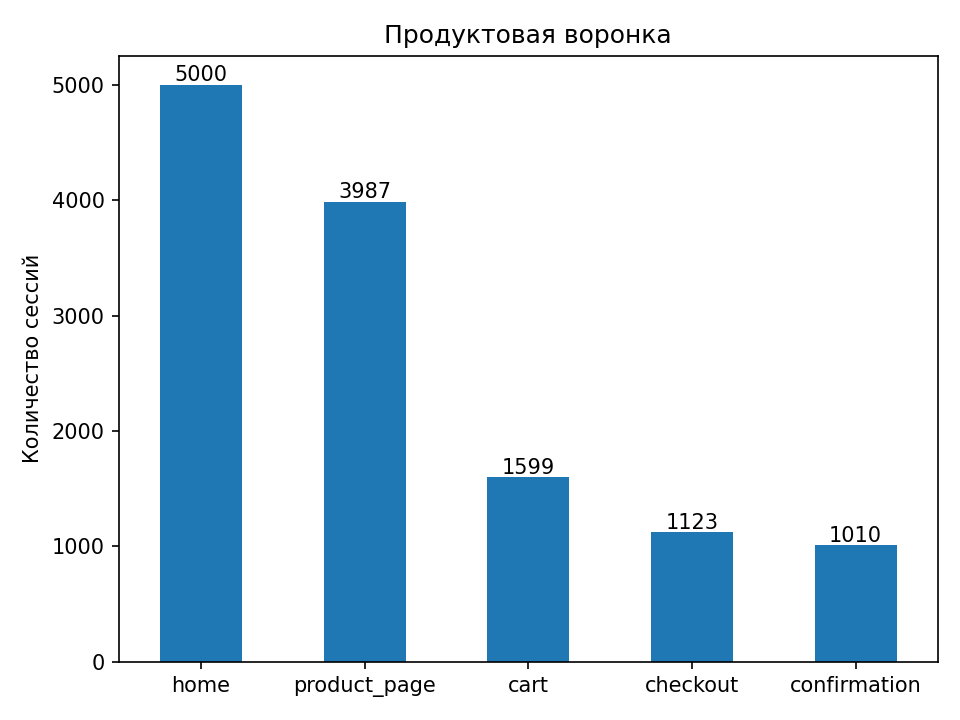
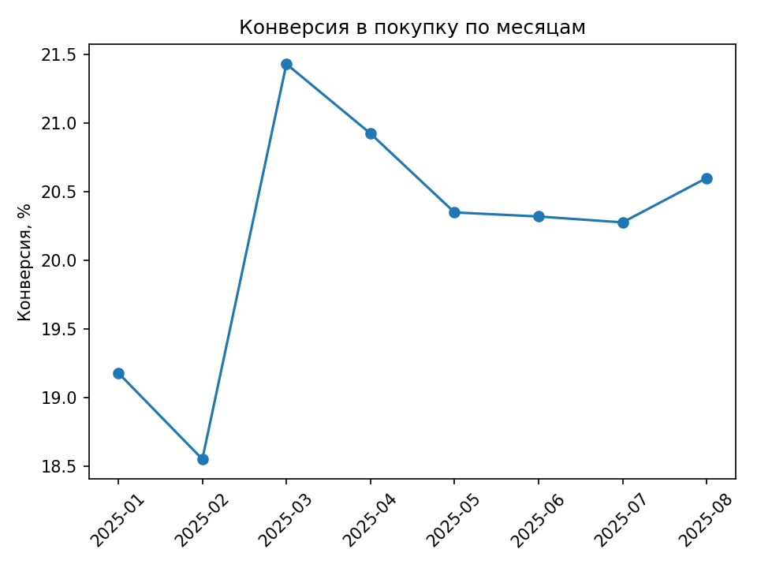

# Анализ продуктовой воронки e-commerce

Анализ пользовательского пути интернет-магазина от первого посещения до подтверждения покупки.

Цель проекта — построить продуктовую воронку, найти этап с наибольшим оттоком пользователей и проверить, как конверсия отличается между устройствами и источниками трафика.

## Результат

В анализ вошли **5 000 сессий** и **1 872 пользователя** за период с января по август 2025 года.

Итоговая конверсия из посещения главной страницы в подтверждённую покупку составила **20,20%**.

Главная точка потери пользователей это переход **Product page → Cart**:

| Этап | Сессии | Конверсия с предыдущего этапа | Drop-off |
|---|---:|---:|---:|
| Home | 5 000 | 100% | — |
| Product page | 3 987 | 79,74% | 20,26% |
| Cart | 1 599 | 40,11% | 59,89% |
| Checkout | 1 123 | 70,23% | 29,77% |
| Confirmation | 1 010 | 89,94% | 10,06% |

На этапе перехода со страницы товара в корзину теряется **59,89% сессий** — это основной проблемный участок воронки.



## Данные

Используется открытый датасет пользовательских сессий e-commerce сайта.

В данных содержатся:

- идентификаторы сессии и пользователя;
- время события;
- этап пользовательского пути;
- тип устройства;
- страна;
- источник трафика;
- время на странице;
- количество товаров в корзине;
- факт покупки.

После проверки данных:

- 12 719 событий;
- 5 000 уникальных сессий;
- 1 872 уникальных пользователя;
- пропущенных значений нет;
- полных дубликатов нет.

Период наблюдений: **01.01.2025–31.08.2025**.

## Методика

Воронка строится на уровне сессии с учётом последовательности событий:

`Home → Product page → Cart → Checkout → Confirmation`

События внутри каждой сессии сортируются по времени. Этап считается достигнутым только в том случае, если пользователь последовательно прошёл предыдущие этапы воронки.

Дополнительно проведён анализ:

- конверсии между соседними этапами;
- итоговой конверсии;
- воронки по типу устройства;
- воронки по источнику трафика;
- динамики конверсии по месяцам;
- соответствия финального этапа `confirmation` факту покупки `Purchased`.

## Сегментный анализ

### Тип устройства

Итоговая конверсия практически одинакова для разных устройств:

| Устройство | Конверсия в покупку |
|---|---:|
| Desktop | 20,35% |
| Mobile | 20,17% |
| Tablet | 20,08% |

Основная потеря пользователей сохраняется на переходе **Product page → Cart** для всех типов устройств.

На этапе Cart → Checkout Desktop показывает более высокую конверсию — **72,78%**, против **68,72%** на Mobile и **69,23%** на Tablet.

В целом основной отток нельзя связать с конкретным типом устройства.

### Источник трафика

Наиболее высокая итоговая конверсия наблюдается у пользователей из **Google — 21,64%**, наиболее низкая — у **Social Media — 19,23%**.

| Источник | Конверсия в покупку |
|---|---:|
| Google | 21,64% |
| Email | 20,06% |
| Direct | 19,82% |
| Social Media | 19,23% |

На проблемном переходе Product page → Cart:

- Google — 42,11%;
- Email — 40,00%;
- Direct — 39,96%;
- Social Media — 38,30%.

Различия между источниками трафика заметнее, чем между типами устройств. Для дальнейшего анализа нужно отдельно исследовать качество трафика и поведение пользователей из Google и Social Media.

## Динамика конверсии

Конверсия в покупку в течение периода находилась примерно в диапазоне **18,55–21,43%**.

Минимальное значение наблюдалось в феврале, максимальное — в марте. С мая по август показатель находился около 20–21% без выраженного тренда.



## Проверка целевого события

Флаг `Purchased` полностью совпадает с достижением этапа `confirmation`.

Все **1 010 сессий**, дошедших до confirmation, имеют `Purchased = 1`. Среди остальных **3 990 сессий** покупок нет.

Поэтому `confirmation` используется как финальный этап продуктовой воронки.

## Вывод

Итоговая конверсия воронки составляет **20,20%**. Основная точка оттока — переход **Product page → Cart**, где теряется **59,89%** сессий.

Сегментация по устройствам не показывает заметных различий в итоговой конверсии. Различия между источниками трафика выражены сильнее: лучшую конверсию показывает Google, худшую — Social Media.

Основной зоной для дальнейшего продуктового исследования является страница товара и переход к добавлению товара в корзину. В первую очередь стоит проверить заметность и удобство CTA, полноту информации о товаре, цену и условия доставки, возможные технические ошибки, а также различия в качестве трафика между каналами.


## Структура проекта

```text
product-funnel-analysis/
├── data/
│   └── customer_journey.csv
├── images/
│   ├── funnel_sessions.png
│   └── monthly_conversion.png
├── notebooks/
│   └── funnel_analysis.ipynb
├── sql/
│   ├── 01_funnel.sql
│   ├── 02_step_conversion.sql
│   └── 03_segment_analysis.sql
└── README.md
```

## Инструменты

**Python:** pandas, matplotlib  
**SQL:** построение воронки и расчёт конверсий  
**Jupyter Notebook:** анализ данных и визуализация  
**Git / GitHub:** структура и хранение проекта

Подробный анализ и расчёты находятся в [`notebooks/funnel_analysis.ipynb`](notebooks/funnel_analysis.ipynb).